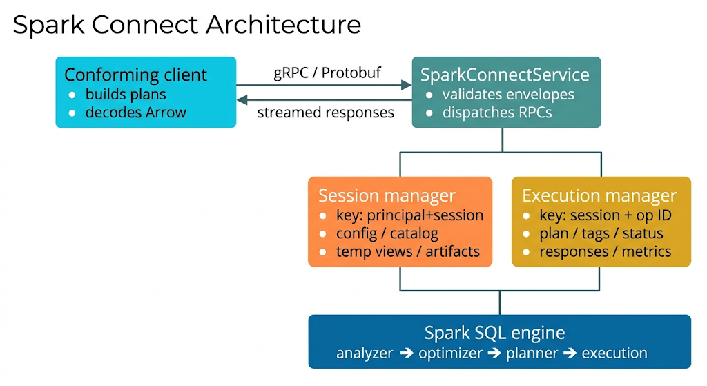

# 4. Overview

The Spark Connect API provides a way for applications to access one or more Apache Spark engines. In the majority of cases, the engine is a Spark cluster managed by an SLA-bearing service; the application connects to it via a gRPC endpoint. However, it is also possible for Spark Connect-compatible servers to be implemented on top of alternative execution engines, provided they conform to this specification.\
This chapter introduces the key concepts of the Spark Connect API: sessions, executions, plans, and result delivery. Deployment topology — single cluster, multi-cluster routing, gatewayed access — is outside the scope of this specification. The protocol is identical regardless of how many Spark engines stand behind a given endpoint, because the gateway pattern (where used) is implemented in terms of this same protocol.

## 4.1 Establishing a Session

The Spark Connect API defines the *session* as the unit of isolated execution context. A logical session is identified by a client-generated session\_id; server\_side\_session\_id identifies its current server-side realization.\
A client establishes a session by:

1. Opening a gRPC channel to a Spark Connect endpoint.\
2. Optionally providing client-supplied UserContext metadata; the specification assigns it no authentication or authorization meaning.\
3. Issuing an RPC classified as session-creating by §8.4.1; other RPCs require an existing session or follow an explicit no-op rule.

Subsequent RPCs from the client carry the `session_id` to associate themselves with the session. The session contains configuration, registered artifacts, registered temporary views, and other session-scoped state.\
See Chapter 8 "Sessions" for the full session lifecycle and semantics.

## 4.2 Executing Plans and Manipulating Results

Once a session is established, an application using the Spark Connect API can execute queries and commands against the target engine. The Spark Connect API provides access to the Spark SQL, DataFrame, Structured Streaming, and Machine Learning capabilities supported by Apache Spark. Implementations vary in their level of support for individual features, but every Spark Connect-conformant server MUST implement the entire normative surface defined in this specification (see Chapter 6 "Compliance").\
Applications use the `ExecutePlan` RPC to submit a logical plan — either as a `Relation` tree (for DataFrame-style plans) or as a `Command` (for DDL, DML, streaming, ML, or catalog operations) — together with optional `Expression` sub-trees. The server returns a stream of `ExecutePlanResponse` messages containing schema information, Arrow-formatted data batches, and execution completion signals.\
For inspection of a plan without executing it, the `AnalyzePlan` RPC returns metadata such as schema, explain text, or whether a plan is streaming. See Chapter 9 "Plan Analysis".

### 4.2.1 Support for Spark SQL Data Types

The Spark Connect API defines proto representations for every Spark SQL data type, including primitives, decimals, date and time types, complex types (Array, Map, Struct), the Variant type, geometry and geography types, and user-defined types. Result data is delivered over the wire in Apache Arrow IPC stream format with a well-defined mapping from Spark types to Arrow types. See Chapters 14 and 15 for portable semantics, SC-1.0-P1-ARROW in the canonical bundle for normative mapping membership, and Appendix B for its informative generated view.

## 4.3 Spark Connect in the Spark Ecosystem

Spark Connect is the protocol of choice for new Spark applications targeting multi-tenant Spark services (managed cloud Spark offerings), serverless notebooks and jobs (where the client and engine are in different processes by design), cross-language clients (Go, Rust, languages without JVM access), and decoupled application lifecycles (long-lived clients against short-lived engines).\
Spark Connect coexists with the in-process Spark API. The two APIs share the same SQL parser, the same Catalyst optimizer, and the same execution engine in the reference implementation; they differ in *deployment topology*, not in *semantics*.\
---

## 4.4 Architecture at a Glance

**Figure 4-1. Request routing and state ownership**\
\
The session owns reusable logical state. Each execution owns one operation's lifecycle and response stream. Authentication, authorization, and deployment identity are outside the Spark Connect 1.0 conformance boundary.
