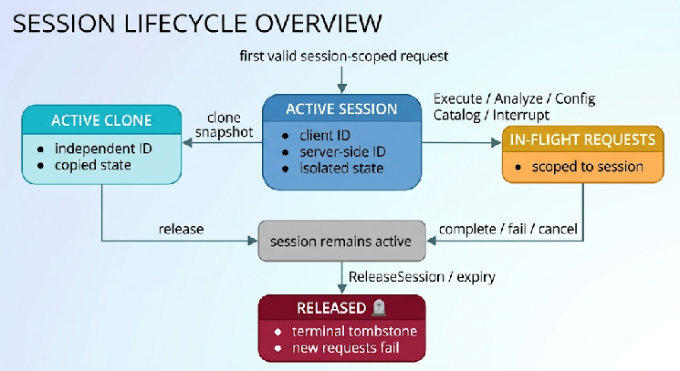

# 8. Sessions

This chapter defines session identity, lifecycle, isolation guarantees, and release semantics. The session is the unit of isolated execution context in Spark Connect. Each session RPC is specified down to its proto fields, with the normative behavior attached to each field; the `ReleaseSession` RPC (§8.4.3.1) is the fully worked example of the level of detail this specification targets for every RPC.

## 8.1 Session Identity

For v1.0 conformance, a logical session is identified by the client-generated `session_id`. A deployment MAY scope the same value by tenant, principal, endpoint, or another private key, but authentication, principal derivation, and cross-principal isolation are outside this specification and are not TCK inputs.

* `session_id` is generated by the client and carried on every session-scoped request. It MUST be a UUID string of the form `00112233-4455-6677-8899-aabbccddeeff`. The server MUST validate the format, reject malformed values with `INVALID_HANDLE.FORMAT`, and otherwise treat the value as opaque.\
* The specification does not define an effective principal or require any credential scheme. Implementations MAY derive additional identity from gRPC context, a gateway, or other deployment infrastructure.\
* `UserContext.user_id` has no standardized authentication or authorization meaning. A deployment decides whether to validate, ignore, overwrite, reject, or otherwise interpret it.\
* A Spark Connect 1.0 conformance claim does not assert that copying a `session_id` or `UserContext` value is safe across trust boundaries. Deployments are responsible for access control.\
* `server_side_session_id` is generated by the server when it materializes a session and is returned on session-scoped responses. It identifies the current server-side realization. A new realization for the same logical session key within the deployment-defined scope MUST receive a different value.

Before any session-scoped operation, the server MUST validate the protocol session fields defined by this chapter. Any credential, principal, tenant, or permission checks are deployment-specific and outside conformance.\
**Restart detection.** Session-scoped requests that define `client_observed_server_side_session_id` may carry the last value observed by the client. When present, the server MUST compare it with the current realization and fail with `INVALID_HANDLE.SESSION_CHANGED` on mismatch. A client observing a changed value MUST assume that configuration, temporary views, artifacts, retained errors, and operation state from the prior realization no longer exist.\
`ReleaseSessionRequest` deliberately omits `client_observed_server_side_session_id`; release remains processable even when realization state changed. Deployment-specific access control remains outside this protocol rule.

## 8.2 The `UserContext`

The protobuf `UserContext` is client-supplied routing and audit metadata:\
message UserContext {\
  string user\_id \= 1;\
  string user\_name \= 2;\
  repeated google.protobuf.Any extensions \= 999;\
}

* `user_id` is a client-supplied identifier. The protocol assigns it no authenticated identity, privilege, or permission semantics.\
* `user_name` is human-readable and informational. The protocol assigns it no permission semantics.\
* `extensions` carry vendor metadata. Their identity or security interpretation, if any, is deployment-specific. Unknown extensions follow protobuf extension handling and cannot create a Spark Connect 1.0 conformance requirement.

Authentication, authorization, principal derivation, and the treatment of `user_id` are outside v1.0 conformance. A deployment may, for example:

1. validate or bind the value under its own identity policy;\
2. overwrite or ignore the value; or\
3. reject the value using a deployment-specific status.

None of these choices affects Spark Connect 1.0 conformance. Implementations are responsible for securing any identity mapping they deploy.\
`UserContext` remains required where the pinned proto requires it, but its presence does not establish authentication, authorization, or a portable principal.\
**TCK boundary.** The core TCK uses a pre-authorized endpoint and does not create multiple principals, validate credentials, spoof `UserContext`, or test permission decisions. Such tests belong to implementation-specific security suites.

## 8.3 The Spark Connect Service Endpoint

A Spark Connect server endpoint is reachable as a gRPC service. Clients connect using the standard gRPC URI scheme (sc://host:port). TLS, authentication mechanisms, credentials, and other deployment connection policy may be expressed through gRPC channel options, but their semantics are outside v1.0 conformance.

### 8.3.1 Connecting to a Spark Connect Server

A client establishes communication with a Spark Connect server by:

1. Constructing a gRPC channel to the server's `host:port`.\
2. Configuring any channel options required by the deployment; credential handling is outside this specification.\
3. Issuing an RPC classified as session-creating by §8.4.1; other RPCs require an existing session or follow an explicit no-op rule.

This specification does not define how credentials are presented or validated, which principals exist, which requests they may perform, or which status a deployment returns for a policy decision. The TCK begins after any required authentication and authorization.

## 8.4 Session Lifecycle

### 8.4.1 Establishing a Session

Session materialization is RPC-specific. The following matrix is the sole v1.0 rule for what an RPC does when its `session_id` is valid, is not active, and has not been tombstoned.

| RPC | Behavior for an unknown session | Materializes a session? |
| :---- | :---- | :---- |
| `ExecutePlan` | Create the session, then validate and execute the request. | Yes |
| `AnalyzePlan` | Create the session, then validate the selected analysis operation. | Yes |
| `Config` | Create the session, then process the selected configuration operation. | Yes |
| `Interrupt` | Create the session, validate the selector, and return an empty `interrupted_ids` list when no operation matches. | Yes |
| `ReleaseSession` | Succeed as an idempotent no-op; echo session\_id and leave server\_side\_session\_id unset. Do not tombstone the unknown key, irrespective of allow\_reconnect; a later session-creating RPC may materialize it. | No |
| `FetchErrorDetails` | Create the session and return an empty-details response because the new session has no retained error token. | Yes |
| `CloneSession` | Fail with `INVALID_HANDLE.SESSION_NOT_FOUND` for a missing source. With an existing source, create only the distinct target session. | Source: No; target: Yes |
| `GetStatus` | Fail with `INVALID_HANDLE.SESSION_NOT_FOUND`. | No |
| `ReattachExecute` (optional) | Fail with `INVALID_HANDLE.SESSION_NOT_FOUND`. | No |
| `ReleaseExecute` (optional) | Fail with `INVALID_HANDLE.SESSION_NOT_FOUND`. | No |
| `AddArtifacts` (deferred) | If implemented, create the session before accepting artifact data. | Yes, if implemented |
| `ArtifactStatus` (deferred) | If implemented, create the session before checking artifact status. | Yes, if implemented |

For a session-creating RPC, the server validates the session UUID and checks the closed-session tombstone before creation. It then materializes the session before most operation-specific validation. Consequently, a valid request envelope may leave a newly created session even when its plan, selector, token, or operation body later fails. A tombstoned key is not recreated and fails with `INVALID_HANDLE.SESSION_CLOSED`.\
For an existing-only RPC, an unknown key fails with INVALID\_HANDLE.SESSION\_NOT\_FOUND and a tombstoned key fails with INVALID\_HANDLE.SESSION\_CLOSED. ReleaseSession is the explicit exception: an absent, already released, or evicted session is a successful no-op as defined in §8.4.3.1. Releasing a never-materialized key does not create a tombstone; a later session-creating RPC may materialize it.\
The optional and deferred rows do not add those RPCs to SC-1.0-P1; they define lifecycle behavior only when the implementation supports them. The core TCK MUST verify every required row in this matrix, including that no-create RPCs do not leave a session behind. It MUST also verify both ReleaseSession boundaries: releasing a never-materialized key with allow\_reconnect=false succeeds and permits a later session-creating RPC to materialize it, while releasing a live session with allow\_reconnect=false tombstones that key and causes the later RPC to fail with INVALID\_HANDLE.SESSION\_CLOSED.

### 8.4.2 Session Isolation

A conforming server MUST guarantee that session-scoped state is not visible across sessions. Specifically:

* Configuration set via `Config.Set` in session A MUST NOT affect session B.\
* Temporary views created in session A MUST NOT be visible in session B.\
* Artifacts registered in session A MUST NOT be visible to plans executed in session B.

Global state (e.g., catalog tables, global temporary views) MAY be shared across sessions according to the catalog implementation, but conforming servers MUST NOT leak session-scoped state through global state. The TCK exercises this guarantee with distinct session\_id values in a pre-authorized environment; it does not certify tenant or principal isolation.

### 8.4.3 Releasing a Session

Session state can end in three distinct ways: explicit ReleaseSession; an in-process implicit release caused by idle timeout or resource-pressure eviction; or loss of the server process. For v1.0, active sessions and closed-session tombstones are process-local state, so process loss is not a tombstoning release. §§8.4.3.1–8.4.3.3 define each post-condition.

#### 8.4.3.1 The `ReleaseSession` RPC

**IDL excerpt status.** The request and response excerpts below are copied verbatim from `base.proto` at the pinned reference commit for traceability. Under §6.1.1, the RPC signature and protobuf message, field, type, number, and enum declarations are authoritative. The prose comments inside the excerpt are historical source notes and are not authoritative lifecycle rules where they conflict with the session matrix or this specification. In particular, the comment that `session_id` “must be an id of existing session” is not a v1.0 precondition, and the default-tombstone comment applies only when a live session exists. The matrix in §8.4.1 and the behavioral contract in this section control those cases.\
`ReleaseSession` is a unary RPC:\
`rpc ReleaseSession(ReleaseSessionRequest) returns (ReleaseSessionResponse) {}`\
**Request message.**\
`message ReleaseSessionRequest {`\
  `// (Required)`\
  `//`\
  `// The session_id of the request to reattach to.`\
  `// This must be an id of existing session.`\
  `string session_id = 1;`

  `// (Required) User context`\
  `//`\
  `// user_context.user_id and session_id both identify a unique remote`\
  `// spark session on the server side.`\
  `UserContext user_context = 2;`

  `// Provides optional information about the client sending the request.`\
  `// This field can be used for language or version specific information`\
  `// and is only intended for logging purposes and will not be`\
  `// interpreted by the server.`\
  `optional string client_type = 3;`

  `// Signals the server to allow the client to reconnect to the session`\
  `// after it is released.`\
  `//`\
  `// By default, the server tombstones the session upon release,`\
  `// preventing reconnections and fully cleaning the session state.`\
  `//`\
  `// If this flag is set to true, the server may permit the client to`\
  `// reconnect to the session post-release, even if the session state`\
  `// has been cleaned. This can result in missing state, such as`\
  `// Temporary Views, Temporary UDFs, or the Current Catalog, in the`\
  `// reconnected session.`\
  `bool allow_reconnect = 4;`\
`}`\
Field-by-field contract:

* `session_id` (field 1, REQUIRED) — the client-generated session identifier to release (§8.1). The server MUST validate the UUID format (`INVALID_HANDLE.FORMAT` on violation).\
* `user_context (field 2, REQUIRED) — carries client-supplied metadata. Its authentication, authorization, routing, or audit interpretation is deployment-specific and outside conformance.`\
* `client_type` (field 3, OPTIONAL) — client language/version string, for logging only. The server MUST NOT let it influence release behavior.\
* `allow_reconnect` (field 4, defaults to `false`) — selects between the two release modes defined below.

Note what is absent: unlike the other session-scoped requests, ReleaseSessionRequest carries no client\_observed\_server\_side\_session\_id. Within the pre-authorized conformance environment, release behavior does not depend on whether the server-side session realization changed since the client last observed it. Deployment access control remains outside scope.\
**Response message.**\
`// Next ID: 3`\
`message ReleaseSessionResponse {`\
  `// Session id of the session on which the release executed.`\
  `string session_id = 1;`

  `// Server-side generated idempotency key that the client can use to`\
  `// assert that the server side session has not changed.`\
  `string server_side_session_id = 2;`\
`}`

* `session_id` — MUST echo the `session_id` from the request.\
* `server_side_session_id` — MUST be set to the released realization's identifier when the session existed at the time of the request, and MUST be left unset when it did not (see idempotency below).

**Behavioral contract.**

1. **State release.** `ReleaseSession` SHALL terminate all in-flight executions on the session and release all session-scoped state: configuration, temporary views, registered artifacts, and cached operation state held for reattachable execution (any subsequent `ReattachExecute` for an operation of this session fails).\
2. **Tombstone mode (allow\_reconnect \= false, the default). When a live session exists at release time, the server MUST tombstone its logical session key for session\_id within the deployment-defined scope. Subsequent RPCs resolving to that released key MUST fail with error class INVALID\_HANDLE.SESSION\_CLOSED; the key cannot be used to materialize a new session. When no session has ever been materialized for the key, ReleaseSession MUST NOT create a tombstone.**\
3. **Reconnect mode (allow\_reconnect \= true). The server MAY permit a subsequent RPC resolving to the same logical session key to materialize a fresh session. The fresh session carries a new server\_side\_session\_id and none of the released session's state; a client choosing this mode MUST NOT rely on any pre-release state (temporary views, temporary UDFs, current catalog/database, configuration) being present after reconnecting.**\
4. **Idempotency. Releasing a session\_id that does not exist — never materialized, already released, or already evicted — is a no-op and MUST succeed. The response echoes session\_id and leaves server\_side\_session\_id unset. The call does not change the key's prior lifecycle state: a never-materialized key remains eligible for later materialization, while an existing tombstone remains closed. Clients MAY therefore retry ReleaseSession safely.**\
5. **Ordering.** The release takes effect for all RPCs that the server processes after it. Requests racing with the release MAY observe either the live session or the released-session error; clients SHOULD stop issuing RPCs on a session once they have initiated its release.

#### 8.4.3.2 In-process implicit release

A server MAY release a live session after inactivity. The idle timeout is implementation-defined, and v1.0 defines no minimum duration. The core TCK MUST NOT wait for a production idle timer; it exercises a declared IDLE\_TIMEOUT reason through the TCK-only adapter below.\
If an in-process implicit release occurs—whether caused by idle timeout or by eviction under resource pressure—it MUST have the same post-condition as `ReleaseSession` of a live session with `allow_reconnect=false`: terminate its operations, release its session-scoped state, and tombstone its logical session key. Subsequent session-creating and existing-session-only RPCs for that key MUST fail with `INVALID_HANDLE.SESSION_CLOSED`; the eviction MUST NOT silently create a fresh realization.\
`SC-1.0-P1` does not require an implementation to support idle-timeout or resource-pressure eviction, but the canonical profile contains two conditional Required Profile rows: `LIFE-SESSION-EVICT-IDLE-1` for `IDLE_TIMEOUT` and `LIFE-SESSION-EVICT-RESOURCE-1` for `RESOURCE_PRESSURE`. An implementation that can perform an in-process eviction for either reason MUST list that reason in the §6.6.1 `session_eviction_reasons` array and provide the standardized TCK-only adapter action `evict_session(session_id, reason)`. Listing a reason makes its row applicable and conformance-gating under §6.6.1. An implementation that never performs a reason MAY omit it; that row is then `NOT_APPLICABLE` and does not gate the result. Omitting a reason that the implementation can perform is an invalid conformance declaration.\
The §6.6.1 adapter declaration and invocation contract are conformance-fixture metadata, not a Spark Connect RPC, server capability-discovery mechanism, or production configuration requirement. For every declared reason, the core TCK MUST invoke the adapter and verify the `SESSION_CLOSED` post-condition. It MUST NOT require an undeclared optional reason and MUST NOT attempt to exhaust real memory, disk, threads, or other resources.

#### 8.4.3.3 Server process restart or loss

Active sessions and closed-session tombstones are process-local under the v1.0 lifecycle. A process restart or loss therefore discards both and is not an in-process tombstoning release. A crash or resource-pressure action that terminates or replaces the process follows this section; a resource-pressure eviction performed while the process remains alive follows §8.4.3.2.\
After the endpoint becomes available again, and before any session-creating RPC has recreated the logical key, an existing-session-only RPC MUST fail with `INVALID_HANDLE.SESSION_NOT_FOUND`.\
The first post-restart session-creating RPC has one of two deterministic paths:

* If it omits `client_observed_server_side_session_id`, it MUST materialize a fresh realization and succeed. The new `server_side_session_id` MUST differ from the value used before restart.\
* If it carries the pre-restart `client_observed_server_side_session_id`, it MUST first materialize and retain a fresh realization and then terminate with `INVALID_HANDLE.SESSION_CHANGED`. This error is intentionally not side-effect-free and the new realization MUST remain active. Its `server_side_session_id` MUST differ from the pre-restart value.

After the stale-ID path returns `SESSION_CHANGED`, an existing-session-only RPC that omits the stale observed identifier MUST succeed and expose the retained realization's `server_side_session_id`. A later session-creating RPC without the stale assertion MUST reuse that same realization; it MUST NOT allocate a second realization.\
`ReleaseSession` before any recreation follows the unknown-session rule in §§8.4.1 and 8.4.3.1: it succeeds as a no-op, creates no tombstone, and does not prevent later materialization. A key tombstoned before restart is likewise eligible for a fresh realization after restart because that process-local tombstone has been lost.\
An in-flight RPC may end with a transport status such as `UNAVAILABLE` while the process is unavailable. That transport outcome does not replace the lifecycle post-conditions above once the endpoint is ready.\
The §6.6.1 deployment descriptor MUST declare the required restart\_server and wait\_ready adapter actions, and the TCK MUST invoke them through SC-TCK-ADAPTER-1. Using independent session keys or separate restarts, the core TCK MUST verify both post-restart entry paths: direct successful materialization without an observed identifier; and stale-ID `SESSION_CHANGED` followed by a successful `GetStatus` without the stale identifier and reuse of the same new `server_side_session_id`. It MUST also verify `SESSION_NOT_FOUND` before recreation and successful post-restart recreation of a key tombstoned before restart. These adapter actions are fixture controls, not Spark Connect RPCs or capability discovery.

## 8.5 Cloning a Session

The `CloneSession` RPC creates a new session that starts from a copy of an existing session's state. It supports session migration and reproducible session reuse.\
**Request message.**\
`message CloneSessionRequest {`\
  `// (Required)`\
  `// The session_id of the source session, set by the client (UUID format).`\
  `string session_id = 1;`

  `// (Optional)`\
  `// Server-side generated idempotency key from the previous responses`\
  `// (if any). Server can use this to validate that the server side`\
  `// session has not changed.`\
  `optional string client_observed_server_side_session_id = 5;`

  `// (Required) User context`\
  `UserContext user_context = 2;`

  `// Provides optional information about the client sending the request,`\
  `// only intended for logging purposes.`\
  `optional string client_type = 3;`

  `// (Optional)`\
  `// The session_id for the new cloned session. If not provided, a new`\
  `// UUID will be generated. The id should be an UUID string of the`\
  `` // format `00112233-4455-6677-8899-aabbccddeeff` ``\
  `optional string new_session_id = 4;`\
`}`

* `session_id identifies the source session within the server's deployment-defined scope; user_context has no standardized security meaning. The source session MUST exist (INVALID_HANDLE.SESSION_NOT_FOUND otherwise).`\
* `client_observed_server_side_session_id` — when present, the server MUST verify it against the source session's current realization and fail with `INVALID_HANDLE.SESSION_CHANGED` on mismatch (§8.1).\
* `new_session_id` — the client MAY supply the clone's `session_id` (UUID format); when absent, the server generates one. The server MUST validate the supplied value: malformed values fail with `INVALID_CLONE_SESSION_REQUEST.TARGET_SESSION_ID_FORMAT`; a key already in use fails with `INVALID_CLONE_SESSION_REQUEST.TARGET_SESSION_ID_ALREADY_EXISTS`; a tombstoned key fails with `INVALID_CLONE_SESSION_REQUEST.TARGET_SESSION_ID_ALREADY_CLOSED`.

**Clone semantics.** The clone is a *copy*, taken atomically at clone time, of the source session's state: configuration, temporary views, registered functions, and current catalog/database state. Registered artifacts MUST be visible in the clone; the server MAY share underlying artifact storage or copy it. After the clone completes, the two sessions are fully independent — changes in one MUST NOT be observable in the other (§8.4.2 applies between source and clone like between any two sessions).\
**Response message.**\
`// Next ID: 5`\
`message CloneSessionResponse {`\
  `// Session id of the original session that was cloned.`\
  `string session_id = 1;`

  `// Server-side generated idempotency key that the client can use to`\
  `// assert that the server side session (parent of the cloned session)`\
  `// has not changed.`\
  `string server_side_session_id = 2;`

  `// Session id of the new cloned session.`\
  `string new_session_id = 3;`

  `// Server-side session ID of the new cloned session.`\
  `string new_server_side_session_id = 4;`\
`}`

* `session_id` — MUST echo the source `session_id`.\
* `server_side_session_id` — MUST carry the source session's realization identifier at clone time; clients use it to detect that the source changed between request and response.\
* `new_session_id` — MUST carry the clone's `session_id` (the client-supplied value when one was given, otherwise the server-generated one). This is the identifier the client MUST use for all subsequent RPCs targeting the clone.\
* `new_server_side_session_id` — MUST carry the clone's realization identifier. Clients MAY store it to detect future restarts of the clone.

---

## 8.6 Session Lifecycle Diagram

**Figure 8-1. Session creation, use, cloning, and release**\
\
Cloning copies the source state at one point in time; it does not link the two sessions. Releasing either session does not release the other. A changed `server_side_session_id` means that a client must not assume previously accumulated session state still exists.
