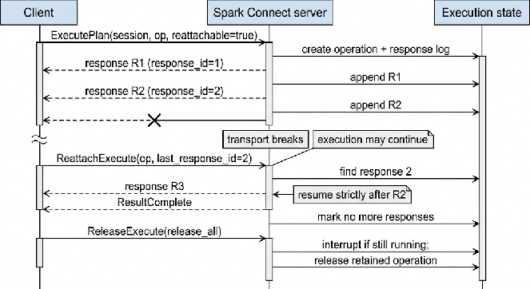

# 10. Execution

`ExecutePlan` is the primary execution RPC. Per §8.4.1, it materializes an unknown non-tombstoned session. One request identifies a session and one logical operation; the server returns an ordered stream of `ExecutePlanResponse` messages. The stream may carry Arrow data, an opaque SQL-command result relation, progress, metrics, observed metrics, schema information, and terminal signaling.\
An operation is distinct from a session. Session state can outlive many operations. For v1.0 conformance, an operation is scoped by (session\_id, operation\_id) within the server's deployment-defined context and has its own response stream, cancellation state, and optional reattachment buffer.\
Required versus optional execution membership is fixed exclusively by manifest SC-1.0-P1 (§6.3). ExecutePlan and Interrupt are required. Reattachable execution is OPTIONAL, but a server implementing it MUST follow Section 10.6 exactly.

## 10.1 `ExecutePlanRequest`

The OSS request envelope is:\
message ExecutePlanRequest {\
  string session\_id \= 1;\
  optional string client\_observed\_server\_side\_session\_id \= 8;\
  UserContext user\_context \= 2;\
  optional string operation\_id \= 6;\
  Plan plan \= 3;\
  optional string client\_type \= 4;\
  repeated RequestOption request\_options \= 5;\
  repeated string tags \= 7;\
}

| Field | Presence | Contract |
| :---- | :---- | :---- |
| `session_id` | Required | Client-generated UUID identifying the logical session. |
| `client_observed_server_side_session_id` | Optional | Last server-generated session identity observed by the client. The server may use it to detect that server-side session state changed or was replaced. |
| `user_context` | Required | Client-supplied metadata with no standardized authentication or authorization meaning. Any deployment interpretation is outside conformance. |
| `operation_id` | Optional | UUID for this logical operation. If absent, the server generates it. |
| `plan` | Required | Exactly one `Relation` or `Command`, as selected by `Plan`. |
| `client_type` | Optional | Logging metadata only. The server MUST NOT interpret it to change required semantics. |
| `request_options` | Optional, repeated | Per-operation options, currently reattachment, result chunking, or a compatible extension. |
| `tags` | Optional, repeated | Labels used by interruption and observability. |

A UUID field MUST use canonical UUID text of the form `00112233-4455-6677-8899-aabbccddeeff`. The server MUST reject a malformed session or operation identifier rather than normalizing it into a different identity.\
The server MUST validate the session identity before analyzing the plan. If `client_observed_server_side_session_id` is supplied and does not identify the current server-side incarnation, the server MUST follow the session-mismatch error behavior defined in Chapter 8. It MUST NOT execute against newly created state while presenting it as the previously observed session.\
The request MUST contain a plan with one selected plan variant. An absent plan, absent plan variant, or unsupported selected variant is an error. It MUST NOT be interpreted as an empty relation or successful no-op.

### 10.1.1 Operation identity and duplicate requests

The effective `operation_id` is returned on every response. A client SHOULD generate a new UUID for each logical operation. It MUST reuse the same identifier only when referring to that same operation through reattachment, release, interruption, or status APIs.\
An already accepted operation ID MUST NOT start a second execution. If live retained state exists and the duplicate request carries the same plan, the server resumes that existing response stream without re-executing the plan. If the plan differs, it fails with INVALID\_HANDLE.OPERATION\_ALREADY\_EXISTS. If the identifier is known but its response state was completed, abandoned, or released, it fails with INVALID\_HANDLE.OPERATION\_ABANDONED. A server MUST NOT accept the duplicate as a new operation. This rule is especially important for commands because duplicate execution can repeat side effects.

### 10.1.2 Tags

Tags MUST be non-empty and MUST NOT contain a comma. Matching for Interrupt by tag is exact and case-sensitive. Tags do not alter plan semantics and have no standardized security meaning.\
The server MUST associate valid tags before execution begins so that an immediate interrupt can observe them. Duplicate strings MAY be deduplicated because tag multiplicity has no semantic meaning.

## 10.2 Request options

Each `RequestOption` selects one option variant. Unknown extension options follow the extension rules in Chapters 3 and 22. A server MUST NOT silently interpret an unknown standard option as a different option.

### 10.2.1 `ReattachOptions`

`ReattachOptions.reattachable=true` requests response buffering and enables `ReattachExecute` and `ReleaseExecute`. When false or absent, the server may release each response immediately after sending it, and the client cannot assume that the operation can be resumed.\
Requesting reattachment does not make a non-supporting v1 server non-conforming. Such a server MUST reject or decline the unsupported option explicitly; it MUST NOT advertise a reattachable stream while discarding the state required to resume it.

### 10.2.2 `ResultChunkingOptions`

`allow_arrow_batch_chunking=true` permits an Arrow batch that would exceed the transport message limit to be split across response messages. `preferred_arrow_chunk_size`, when present, is a preferred byte size. Valid values are from 1 KiB through the server maximum; an absent or out-of-range preference causes the server maximum to be used.\
The preference is not a hard upper bound. A server may be unable to split a single logical value below it. When chunking is disabled, an oversized Arrow response may fail at the gRPC message-size boundary.

## 10.3 `ExecutePlanResponse`

Every response carries these identity fields outside its response-type `oneof`:

| Field | Contract |
| :---- | :---- |
| `session_id` | MUST equal the request session. |
| `server_side_session_id` | MUST identify the current server-side session incarnation. |
| `operation_id` | MUST equal the supplied operation ID or the UUID generated by the server. |
| `response_id` | MUST be a UUID uniquely identifying this response within the operation stream. It is an opaque reattachment cursor. |

A response selects at most one `response_type`. Schema, metrics, and observed metrics are separate fields and may accompany the selected response type. A client MUST route messages by the selected `response_type`; it MUST NOT infer the type from which auxiliary fields happen to be populated.\
Responses for one operation form a total order. The server MUST preserve logical row order across Arrow batches and chunks. Clients MUST process the stream in arrival order and MUST NOT sort by UUID values.

### 10.3.1 Arrow batches

`ArrowBatch` contains:

* `row_count`: number of logical rows in the complete Arrow batch; it MUST match the decoded batch.\
* `data`: serialized Arrow IPC bytes, or one chunk of those bytes when chunking is active.\
* `start_offset`: optional zero-based row offset in the overall execution result.\
* `chunk_index`: optional zero-based index of this chunk within the batch.\
* `num_chunks_in_batch`: optional total chunks for the batch; its presence indicates chunking.

When chunking is active, chunks for a batch MUST have the same batch identity implied by stream position, `chunk_index` MUST start at zero and increase without gaps, and all chunks MUST be reassembled before Arrow decoding. `row_count` describes the logical batch, not the number of rows decodable from an individual fragment.\
The service contract guarantees at least one Arrow batch even when the tabular result has zero rows. A conforming client MUST therefore handle a zero-row batch, and a server MUST NOT use absence of Arrow batches as the representation of an empty tabular result.

### 10.3.2 Schema

The optional `schema` field is a Spark Connect `DataType`, normally a `Struct`, describing collected tabular output. When present, it MUST describe every Arrow batch in that result. Field order, nested nullability, precision, scale, collation, and timestamp flavor MUST agree with the encoding rules in Chapters 14 and 15.\
The schema is auxiliary response data, not a `response_type` variant. A client MUST NOT require it to appear in a dedicated schema-only response unless a more specific API contract says so.

### 10.3.3 SQL command result

`SqlCommandResult` contains an opaque `Relation`. It allows the client to use the result of a SQL command as input to a subsequent plan. The client MUST preserve that relation as protocol data and MUST NOT assume it can reconstruct or evaluate the server-side relation locally.

### 10.3.4 Metrics, observed metrics, and progress

`metrics` reports physical execution metric objects keyed by plan IDs and parent relationships. `observed_metrics` reports named observed values, their keys, plan ID, and optionally a structured error chain. `execution_progress` reports stage/task progress and input bytes.\
These fields are diagnostic unless another chapter states otherwise. Physical operator names, metric sets, and timing are not portable. However, every metric and progress record MUST belong to the response's operation and MUST NOT expose another session's state.

### 10.3.5 `ResultComplete`

For reattachable execution, `ResultComplete` is the authoritative signal that no additional execution responses remain after stream completion. If a reattachable response stream closes without `ResultComplete`, the client MUST assume that more responses may exist and SHOULD continue with `ReattachExecute`.\
After `ResultComplete`, the server MUST NOT produce additional result or progress responses for that operation. A client SHOULD release retained operation state with `ReleaseExecute` when it no longer needs to reattach.

## 10.4 Relation and command execution

A relation is analyzed against the identified session's configuration, catalog, temporary objects, and registered state, then executed. Analysis failure terminates the operation using Chapter 7. An empty result is successful and follows the zero-row Arrow rule in Section 10.3.1.\
A command is executed once for the accepted logical operation. Commands returning tabular data follow the Arrow contract. Commands with a command-specific response use the corresponding response variant. Successful completion without user rows is not evidence that the command was skipped.\
The server MUST NOT emit `ResultComplete` after a terminal error. Arrow batches received before an error are a partial failed result; a conforming client MUST NOT present them as a successful complete result.

## 10.5 SQL execution

SQL reaches execution through `SqlCommand` or `Relation.SQL`; Spark Connect defines no separate SQL RPC. The core profile standardizes request framing, typed parameters, session binding, result delivery, errors, and the Portable SQL Core query grammar in Appendix I.\
Named and positional parameters are expressions. A client MUST NOT bind values by textual substitution, and a request MUST NOT provide mutually exclusive named and positional forms together.\
A conforming server MUST accept Portable SQL Core text with the session catalog, namespace, time zone, and configuration. It MAY accept a complete engine dialect and MAY identify that dialect in deployment evidence.\
**TODO-SPARK-SQL-SPEC:** A complete Spark SQL dialect specification and TCK have not been published. Until that separate artifact is finalized, this specification defines no Spark SQL dialect conformance claim. A deployment MAY describe additional Spark SQL behavior, but that behavior does not satisfy or expand core conformance.\
Core relation and expression cases construct required plans directly as protobuf. Core SQL-text cases use only `SC-1.0-P1-PORTABLE-SQL`; restricted `ExpressionString` cases use `EXPR-*`. Complete-dialect syntax and eager command cases belong to a future separately claimed dialect profile.

## 10.6 Reattachable execution (OPTIONAL in v1.0)

### 10.6.1 `ReattachExecute`

`ReattachExecuteRequest` carries `session_id`, optional `client_observed_server_side_session_id`, `user_context`, required `operation_id`, optional `client_type`, and optional `last_response_id`.\
The target operation MUST have begun with `ReattachOptions.reattachable=true`. When `last_response_id` is present, the resumed stream begins strictly after that response. When absent, the server restarts delivery from the earliest retained response.\
`last_response_id` is opaque. If it is malformed, belongs to a different operation, or is older than the retained buffer, the server MUST fail instead of skipping ahead or re-executing the plan. Reattachment resumes delivery; it MUST NOT repeat command side effects.

### 10.6.2 Response retention

The server controls buffer size and retention time and may discard responses far behind the latest delivered response. Retention therefore permits recovery from bounded interruption, not arbitrary scrolling through operation history.\
The server MUST distinguish a live retained operation, a completed retained operation, a released or expired operation, and an unknown operation. Expiration or release MUST NOT cause a later reattachment attempt to create a new execution.

### 10.6.3 `ReleaseExecute`

`ReleaseExecuteRequest` selects exactly one release mode:

* `release_until(response_id)` releases cached responses through and including the named response. If the response is not found in the cache, this mode is a no-op.\
* `release_all` releases and closes the complete operation. If execution is still running, it interrupts the query and waits for teardown.

Release is monotonic. Released responses MUST NOT reappear. `ReleaseExecuteResponse.operation_id` is present and equals the request operation when the operation was found; it may be absent when the operation was already or concurrently released.

## 10.7 Interruption

`InterruptRequest.interrupt_type` is one of `ALL`, `TAG`, or `OPERATION_ID`. `TAG` requires `operation_tag`; `OPERATION_ID` requires `operation_id`; `ALL` requires neither selector. A contradictory type and selector combination is invalid.

* `ALL` targets active executions only in the identified session.\
* `TAG` targets active executions in that session whose tag exactly matches `operation_tag`.\
* `OPERATION_ID` targets the named execution only in that session.

`InterruptResponse` echoes `session_id`, returns `server_side_session_id`, and lists the operation IDs actually interrupted in `interrupted_ids`. An empty list is a valid no-match result. Per §8.4.1, `Interrupt` materializes an unknown non-tombstoned session and therefore returns an empty `interrupted_ids` list when no operation exists. Cancellation is cooperative, but the server MUST make a best effort to stop work and MUST eventually move affected operations to a terminal state.\
An interrupted result stream MUST end as cancelled or failed according to the structured error contract. It MUST NOT mark partial output complete.

## 10.8 Operation status

`GetStatusRequest.operation_status.operation_ids` selects operations. When the list is absent or empty, the server returns all operations visible in the session. Status is observational and MUST NOT mutate or retain an operation. Per §8.4.1, `GetStatus` requires an existing session and fails with `INVALID_HANDLE.SESSION_NOT_FOUND` for an unknown session; it never materializes one.\
Each returned `OperationStatus` identifies an operation and one state:

* `UNKNOWN`\
* `RUNNING`\
* `TERMINATING`\
* `SUCCEEDED`\
* `FAILED`\
* `CANCELLED`

`UNSPECIFIED` is not a valid observable lifecycle state for a known operation. Terminal states MUST NOT transition back to `RUNNING`. Status is a snapshot; clients use the execution stream as the authority for results and terminal errors.

## 10.9 Transport failure, flow control, and retries

The server SHOULD honor gRPC backpressure and SHOULD produce results incrementally. Clients MUST keep consuming until normal completion, terminal error, or explicit cancellation.\
A transport failure without successful reattachment leaves completion indeterminate. Retrying `ExecutePlan` under a new operation ID creates a new logical operation and can repeat side effects. A client MUST NOT automatically retry a non-idempotent command without application-level knowledge.\
All analysis and execution failures use Chapter 7. A transport-level status MUST NOT replace available structured Spark error details, and diagnostic enrichment MUST NOT expose another user's or session's data.

## 10.10 Execute and Reattach Sequence

**Figure 10-1. Normal delivery and recovery after a broken stream**\
\
Reattachment resumes delivery; it does not rerun the plan. If the stream closes without `ResultComplete`, the client must assume more responses may remain. `release_until` frees acknowledged responses, whereas `release_all` closes the operation and interrupts it if it is still running.

## 10.11 Consolidated operation lifecycle

The execution state reported by `GetStatus` and the retention state used for reattachment are separate dimensions.

| Execution state | Meaning and permitted transitions |
| :---- | :---- |
| `UNKNOWN` | No visible retained status record. It does not prove that an operation never ran. Acceptance of a new `ExecutePlan` request, not status lookup, creates a new logical operation. |
| `RUNNING` | The accepted operation may analyze, execute, and emit responses. It may transition directly to a terminal state or through `TERMINATING`. |
| `TERMINATING` | Cancellation or teardown has begun. It may transition only to `SUCCEEDED`, `FAILED`, or `CANCELLED`; it MUST NOT return to `RUNNING`. |
| `SUCCEEDED` | Execution completed successfully. For a reattachable operation, delivery is complete only after `ResultComplete` and normal stream termination. |
| `FAILED` | Execution ended with the Chapter 7 terminal failure. Previously delivered batches remain an incomplete failed result. |
| `CANCELLED` | Execution ended through cancellation or interruption. Partial output is not a complete result. |

Retention is orthogonal: an operation may be unbuffered, retained, partially released through `release_until`, or fully released/expired. Releasing or expiring retained responses MUST NOT change the historical terminal state into a new execution, and reattachment MUST NOT repeat command side effects.\
The authoritative terminal evidence is the execution stream: normal completion under the applicable response contract, or its terminal gRPC status. `GetStatus` is a snapshot and MUST NOT override contradictory stream evidence. Clients MUST treat completion as indeterminate after a transport break unless reattachment or another application-level mechanism establishes the outcome. Automatic retry of a non-idempotent command under a new operation ID remains prohibited without application knowledge.
